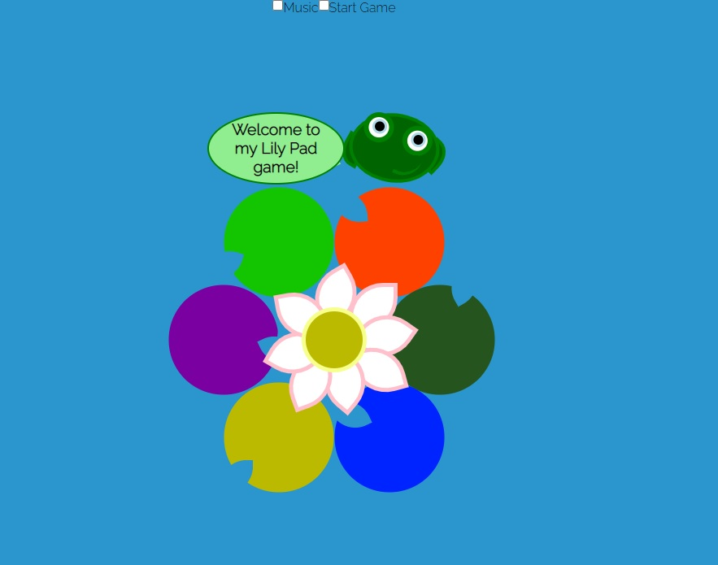
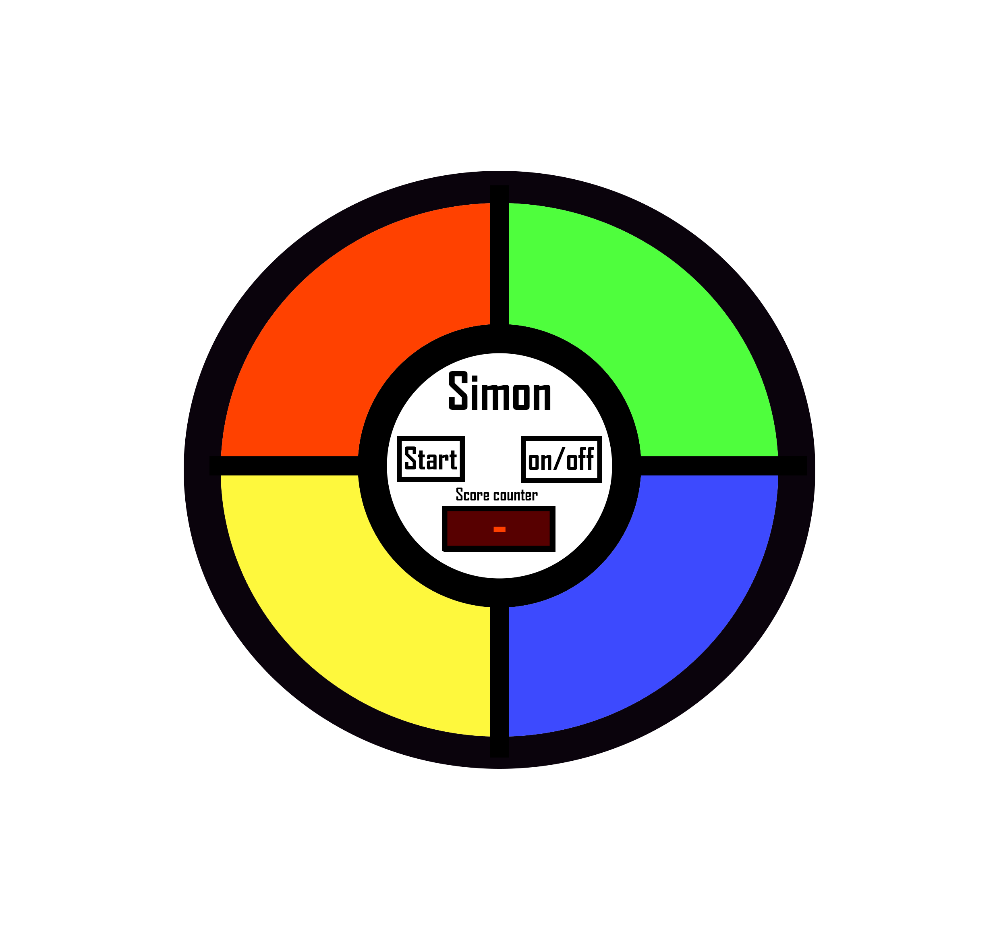
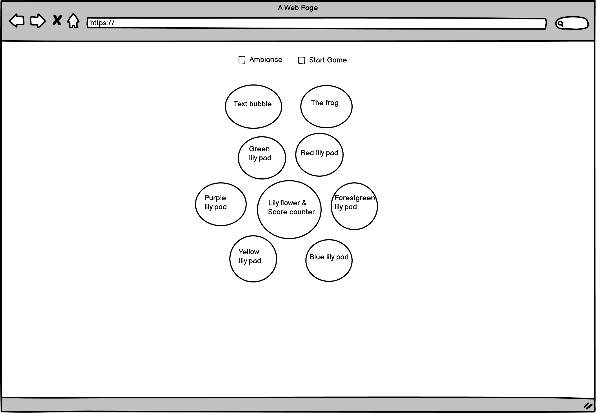

# Lily Pad Game

This project is created to help anyone improve their memory while having a fun time.
With a cute and simple design and an easy to use layout.

The Lilypad game challenges the user to remember patterns. In the game there are six colored 
lily pads that light up in randomly generated patterns. The user will repeat the patterns 
shown by pressing the lily pads in the same order. 

When pressing the start button the game begins with one random lily pad lighting. If the 
user clicks on the same lily pad as the computer, they have completed that level and moves 
to the next. After a completed level, another random lily pad will be added and to the pattern. 
Now the user needs to remember and follow the old patterns and the new to complete the level. 
In the game there are 15 levels, If the user successfully completes all 15 levels they win the game.

## Showcase

A deployed version of my game can be found [here.](https://jesperkarlsson500.github.io/ Fill this part in)
## Navigation

* [UX](#ux)
* [Strategy](#strategy)
    + [User-needs](#user-needs)
    + [Business-vision](#business-vision)
* [Scope](#scope)
* [Structure](#structure)
* [Wireframes](#wireframes)
  + [Changes](#changes-to-wireframes)
* [Features](#features)
    + [Existing-features](#existing-features)
    + [Future-features](#futere-features)
* [Technologies](#technologies)
* [Testing](#testing)
+ [Testing-plan](#testing-plan)
  + [Implementation](#implementation)
  + [Results](#results)
* [Bugs](#bugs)
* [Deployment](#deployment)
* [Credits](#credits)
* [Media](#media)
* [Acknowledgements](#acknowledgements)

## UX

The purpose of this game is to help anyone improve their memory while having a good time. 
Put on the ambiant music in the game, sit back, relax and follow the frog from lily to lily. 
To help the user remember what lily pad to jumped to, they are all colored differently and have a unique splash sound
when clicked.

### UX Stories

* As a user I want to have fun.
* As a user I want to follow patterns and improve my memory.
* As a user I want to learn in a relaxed and colorful inviroment
* As a user I want to easily pick up how the game works
* As a user I want to see how good my memory is.

A user for my Lilypad game is looking to improve their memory and have fun doing it.

## Strategy

#### User Needs
Be fun, user friendly and challanging throughout the whole experience.
An easy to see favicon so you can find the game in all your tabs. we're all guilty of that.

#### Business vision
As a business I see the market being saturated with memory games. 
This doesn't mean it's a no go. There are possibilites with my frog themed Simon inspired game.
I need to test it with the targeted audiance, to see their reactions
and if it's something they want.

## Scope
I want the user to be happy in a relaxed learning inviroment

## Structure
The game is made up of one page. 
It consists of six lilypads that light up in a randomized pattern. Every turn 
you complete the pattern increases by one until you reach the score of 15. 
At 15 you won the game.

## Wireframes

I started making the game to look like the Simon game

I later on changed the look and and layout to be more unique.

### Changes to wireframes

## Original ideas

Originally I was planning to make a Simon game. I wanted to learn how to do it and create a fun game. 
But the more I worked on it the more it fell flat. I know it's just a simon game but still... 
I wanted to upgrade it a little. One day I was walking over a bridge and saw a bunch of beautiful lily pads in the water.
At that moment I knew I wanted to change the look to have the user jump from lily pad to lily pad.
This would be more pleasing to look at and also make the game more sellable

## Features

* Start game button.
* on/off button for the ambiant music.
* Score counter if the middle of the lilyflower that increments after each succesful turn.
* after reaching 15 turns you win the game and "WIN!" will show up to replace the numbers
* All lilypads will flash their colors if you win the game (currently not working)
* A frog that introduces you to the game and keeps it's eyes on the mouse.

## Technologies

This project was build using the following technologies:

* HTML5
* CSS3
* Google Chrome DevTools: Helped me iterate, debug and profile my site.
* Lighthouse: Helped me improve the websites performance on both desktop and mobile.
* Jigsaw W3C validator: Validated and tested my CSS.
* W3C Markup validator: Validated and tested my HTML.
* Used [this.](https://favicon.io/favicon-generator/) to create my favicon.

## Testing

Changed splash sound on the red and yellow leaf since they sounded a bit harsh. 

The game doesn't reset when the win condition is met, So I need to fix that.

I found so far that if you win the game nothing happens. I will look into this.

The game's score counter only went up to four. I typed in console.log(order); 
to find out that the for loop only looped three times. 
In the for loop I had type in i < 3, so I changed it back to i < 15 as it should be.

### Testing plan

My testing plan is to play the game and make sure it works on desktop.
Any problems that comes up I will 

### Implementation

#### When using code validator I found:

## Results

## Bugs

Sometimes If I click the lilys very fast the game bugs and start acting real strange. 
Lilys that are no supposed to be flashed start flashing. 
The speed of the whole game changes and a restart is needed to solve the problem.

## Deployment

## Credit

## Media

* Sound effect taken from youtube [Link here.](https://www.youtube.com/watch?v=WS_3OCcKiJ0)

* Moving eye effect taken from youtube [link here.](https://www.youtube.com/watch?v=AixAmLWzXYg)

* Yaykids sound effect taken from youtube [link here.](https://www.youtube.com/watch?v=_Z3ra0CxCE0)

* Cut and modified the sounds myself in the program Ableton live.

* README template from code institute. [README.md template](https://github.com/Code-Institute-Solutions/readme-template).

* Custom favicon created at [favicon.io.](https://favicon.io/favicon-generator/)

## Acknowledgements

**This project was created for educational purposes only, credit for all images goes to their owners**

**Created by Jesper Karlsson**